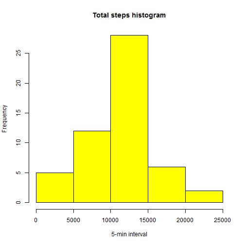

## Loading and preprocessing the data


```r
activity <- read.csv("activity.csv", colClasses = c("numeric", "character",  "numeric"))

str(activity)
```

'data.frame':	17568 obs. of  3 variables:
 $ steps   : num  NA NA NA NA NA NA NA NA NA NA ...
 $ date    : chr  "2012-10-01" "2012-10-01" "2012-10-01" "2012-10-01" ...
 $ interval: num  0 5 10 15 20 25 30 35 40 45 ...

```r
names(activity)
```

[1] "steps"    "date"     "interval"

```r
# format date
activity$date <- as.Date(activity$date, format = '%Y-%m-%d')
head(activity)
```

  steps       date interval
1    NA 2012-10-01        0
2    NA 2012-10-01        5
3    NA 2012-10-01       10
4    NA 2012-10-01       15
5    NA 2012-10-01       20
6    NA 2012-10-01       25

## What is mean total number of steps taken per day?

Total steps per day

```r
TotalSteps <- aggregate(steps ~ date, data = activity, sum, na.rm = TRUE)
```

Histogram

```r
# Save plot to PNG file
#png("figure/plot1.png", width=480, height=480)

hist(TotalSteps$steps, main = "Total steps histogram", xlab = "5-min interval", col = "yellow")
```

 

```r
# Close graphic device
#dev.off()
```


Mean and Median of total number of steps taken per day

```r
mean(TotalSteps$steps)
```

[1] 10766.19

```r
median(TotalSteps$steps)
```

[1] 10765


## What is the average daily activity pattern?
Make a time series plot (i.e. type = "l") of the 5-minute interval (x-axis) and the average number of steps taken, averaged across all days (y-axis)

```r
ave_steps_per_interval <- aggregate(steps ~ interval, activity, mean)

# Save plot to PNG file
#png("figure/plot2.png", width=480, height=480)

plot(ave_steps_per_interval, type = "l", xlab="5-min interval", ylab="Average Steps per interval", main="average number of steps taken, averaged across all days")
```

 

```r
# Close graphic device
#dev.off()
```

Which 5-minute interval, on average across all the days in the dataset, contains the maximum number of steps?

```r
ave_steps_per_interval$interval[which.max(ave_steps_per_interval$steps)]
```

[1] 835

## Imputing missing values

Calculate and report the total number of missing values in the dataset (i.e. the total number of rows with NAs)

```r
sum(is.na(activity))
```

[1] 2304

Devise a strategy for filling in all of the missing values in the dataset:
We'll use the mean of the intervals to fill in the missing values in the dataset.

```r
activity_imputed <- activity
```

Create a new dataset that is equal to the original dataset but with the missing data filled in.

```r
activity_imputed$steps <- with(activity_imputed, impute(steps, mean))
```

Make a histogram of the total number of steps taken each day and Calculate and report the mean and median total number of steps taken per day. Do these values differ from the estimates from the first part of the assignment? What is the impact of imputing missing data on the estimates of the total daily number of steps?

```r
Total_steps_imputed <- tapply(activity_imputed$steps, activity_imputed$date, sum)

mean(TotalSteps$steps)
```

[1] 10766.19

```r
mean(Total_steps_imputed)
```

[1] 10766.19

```r
median(TotalSteps$steps)
```

[1] 10765

```r
median(Total_steps_imputed)
```

[1] 10766.19

```r
# Save plot to PNG file
#png("figure/plot3.png", width=480, height=480)

qplot(Total_steps_imputed, xlab='Total steps', ylab='Frequency', binwidth = 2000)
```

 

```r
# Close graphic device
#dev.off()
```

**imputing the missing data:  mean remains the same, median is increased.**

## Are there differences in activity patterns between weekdays and weekends?

Create a new factor variable in the dataset with two levels - "weekday" and "weekend" indicating whether a given date is a weekday or weekend day

```r
activity$dayGroup <- ifelse(weekdays(activity$date) %in%  c("Saturday", "Sunday"),'weekend','weekday')

head(activity)
```

  steps       date interval dayGroup
1    NA 2012-10-01        0  weekday
2    NA 2012-10-01        5  weekday
3    NA 2012-10-01       10  weekday
4    NA 2012-10-01       15  weekday
5    NA 2012-10-01       20  weekday
6    NA 2012-10-01       25  weekday

```r
table(activity$dayGroup)
```


weekday weekend 
  12960    4608 

Make a panel plot containing a time series plot (i.e. type = "l") of the 5-minute interval (x-axis) and the average number of steps taken, averaged across all weekday days or weekend days (y-axis)

```r
# Save plot to PNG file
#png("figure/plot4.png", width=480, height=480)

qplot(x=interval, y=steps,data=subset(activity, complete.cases(activity)),geom='smooth', stat='summary', fun.y=mean) + facet_grid(dayGroup~.) + facet_wrap(~dayGroup,nrow=2) + theme(strip.background = element_rect(fill="purple")) + labs(title='Ave #steps taken, averaged across all weekday or weekend days')
```

 

```r
# Close graphic device
#dev.off()
```


